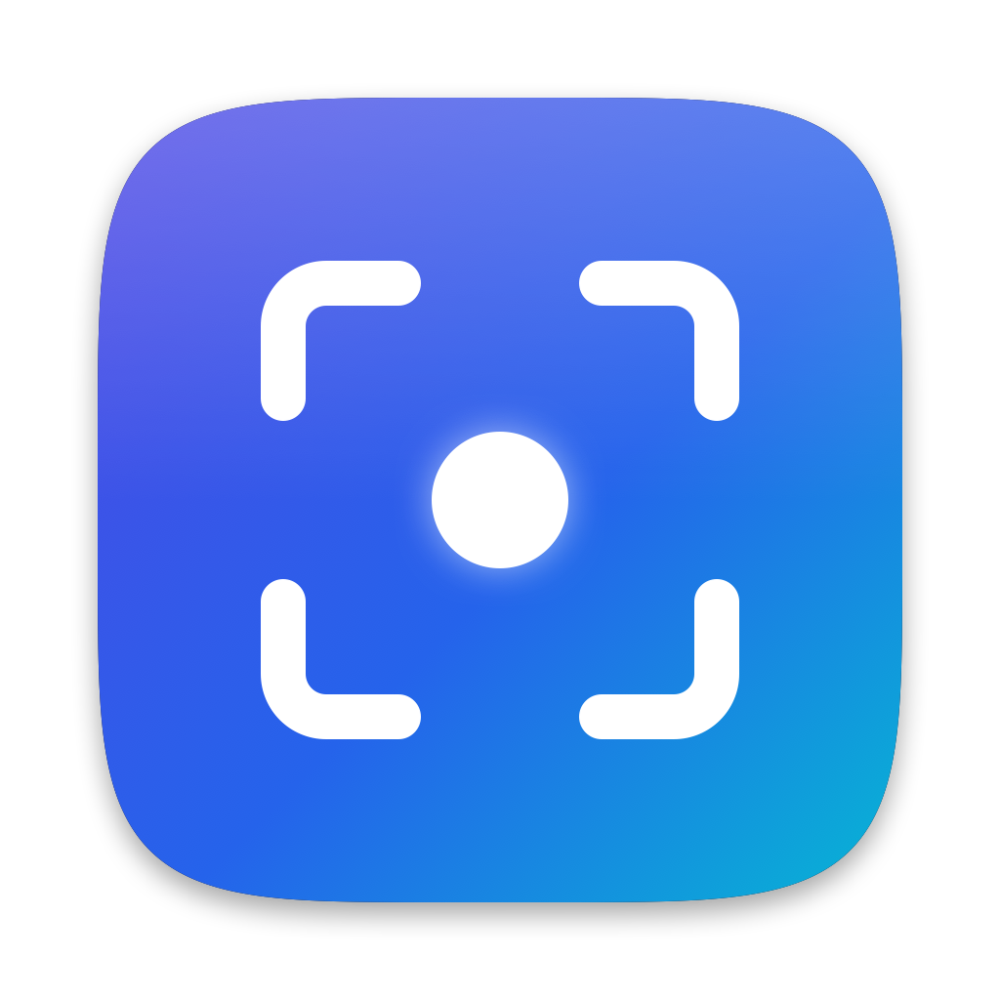

<p align="center"></p>

# OneShot

A fast, open-source screenshot tool for macOS, inspired by CleanShot X. Lives in the menu bar.

## Features

- **Area capture** with a frozen screen, magnifier loupe and live size label
- **Window capture**: press <kbd>Space</kbd> during area selection, click a window (optional shadow)
- **Fullscreen** and **previous area** capture
- **Copy to clipboard** (including a copy-only shortcut that skips the preview) and/or **save to a folder** (PNG or JPEG, Retina-aware DPI, optional 1x)
- **Quick Access overlay**: thumbnail after each capture with Copy, Save, Pin, Copy Text, Open, and drag & drop into any app
- **Pin to screen**: always-on-top screenshots. Scroll to resize, <kbd>⌥</kbd> + scroll for opacity, right-click for more, click-through lock
- **Upload to S3-compatible storage** (AWS S3, Cloudflare R2, Backblaze B2, MinIO): public, custom-domain or presigned links copied to the clipboard, upload history with remote delete, keys in the Keychain
- **Text recognition (OCR)** and QR/barcode reading, fully on-device via Apple Vision

See [ROADMAP.md](ROADMAP.md) for what is coming next.

## Default shortcuts

All shortcuts can be changed or cleared in **Settings › Shortcuts**.

| Action | Shortcut |
| --- | --- |
| Capture Area (Space toggles window mode) | <kbd>⇧⌘4</kbd> |
| Capture Area to Clipboard (copy only, no preview, no file) | <kbd>⌃⇧⌘4</kbd> |
| Capture Previous Area | <kbd>⌥⇧⌘4</kbd> |
| Capture Window | not set |
| Capture Fullscreen | <kbd>⇧⌘3</kbd> |
| Capture Text (OCR) | <kbd>⇧⌘2</kbd> |

macOS reserves <kbd>⇧⌘3</kbd> and <kbd>⇧⌘4</kbd> for its own screenshot tool. OneShot offers to disable those on first launch; you can toggle them any time in **Settings › Shortcuts**. Other screenshot apps using the same shortcuts (for example CleanShot X) must release them too.

## Requirements

- macOS 14 Sonoma or later
- Xcode 16 or later (Swift 6 toolchain)

## Building

```sh
make cert      # once: creates a local self-signed signing identity (recommended)
make install   # builds build/OneShot.app, copies it to /Applications and launches it
```

Other targets: `make build` (debug build), `make test` (unit tests), `make app` (bundle only), `make run`, `make clean`.

The app icon is drawn in code; regenerate it with `swift scripts/generate-icon.swift Resources/AppIcon.icns`.

### Why the local signing certificate?

macOS ties the Screen Recording permission to the app's code signature. Ad-hoc signed builds get a new signature on every build, so macOS would ask for permission again after each rebuild. `make cert` creates a self-signed identity named `OneShot Local Signing` in your login keychain; `scripts/build-app.sh` uses it automatically. To use your own identity set `ONESHOT_SIGN_IDENTITY`.

To remove the certificate later: open Keychain Access, search for "OneShot Local Signing", and delete the certificate and its private key.

## Permissions

- **Screen & System Audio Recording**: required for every capture. Grant it in System Settings › Privacy & Security, then relaunch OneShot.

## Project layout

```
Sources/OneShotCore/   Platform-independent logic with unit tests (Tests/OneShotCoreTests)
Sources/OneShot/
  App/        App entry point, menu bar
  Capture/    ScreenCaptureKit capture, selection overlay, capture flows
  Output/     Encoding, clipboard, saving, Quick Access overlay, toasts
  Pin/        Pinned screenshot windows
  OCR/        Vision text and barcode recognition
  HotKeys/    Global hotkeys, macOS screenshot shortcut toggling
  Settings/   Preferences and settings window
  Support/    Permissions and helpers
```

## License

MIT
