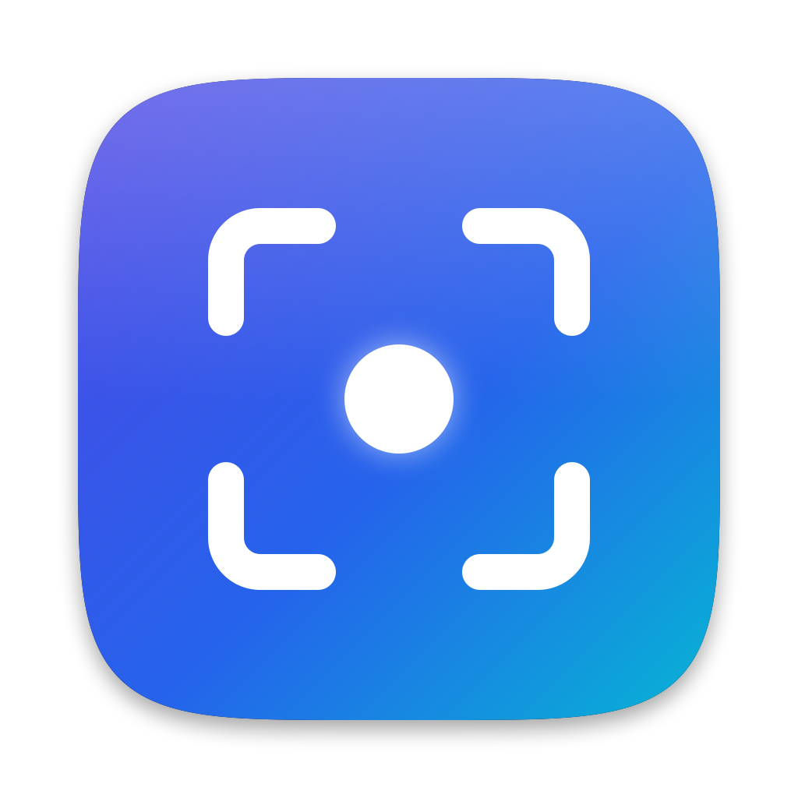
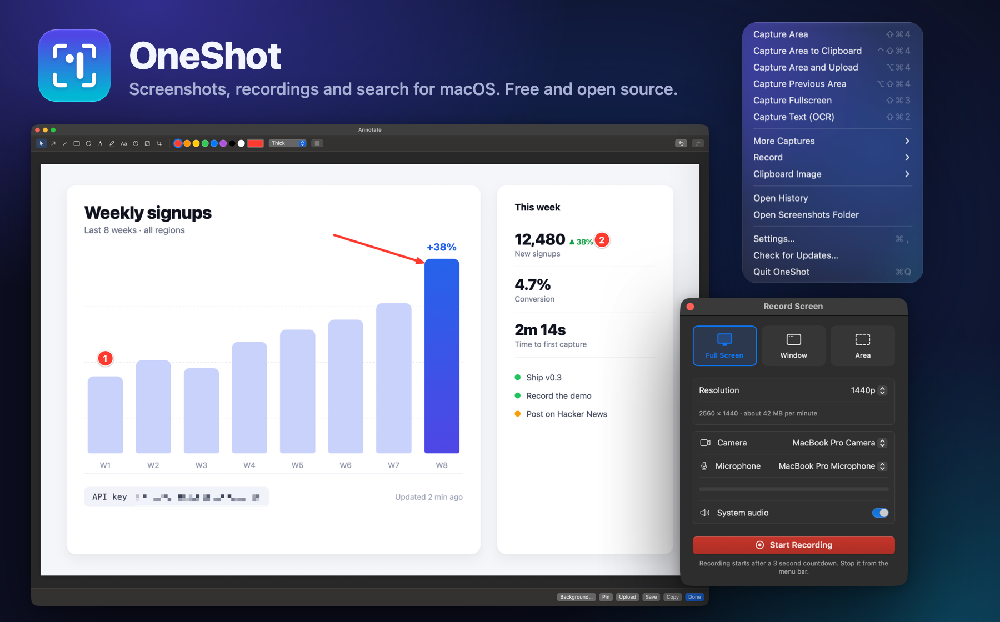
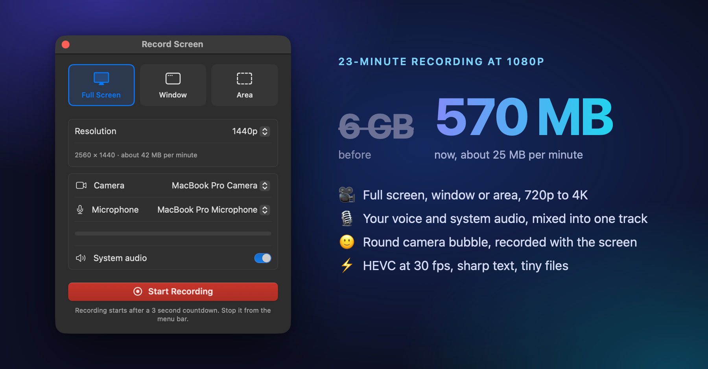
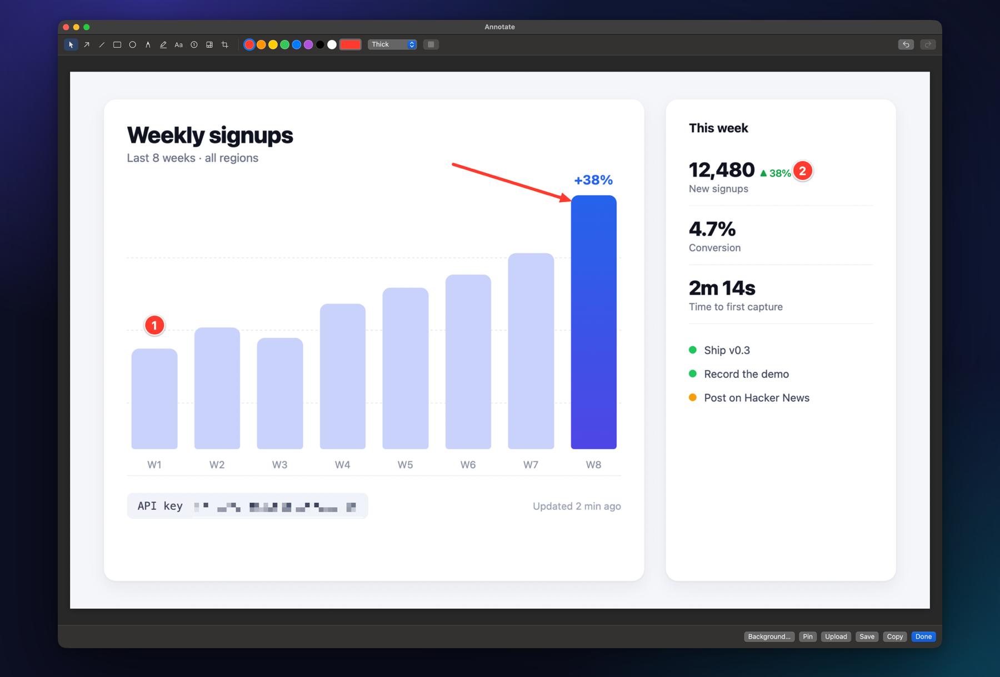
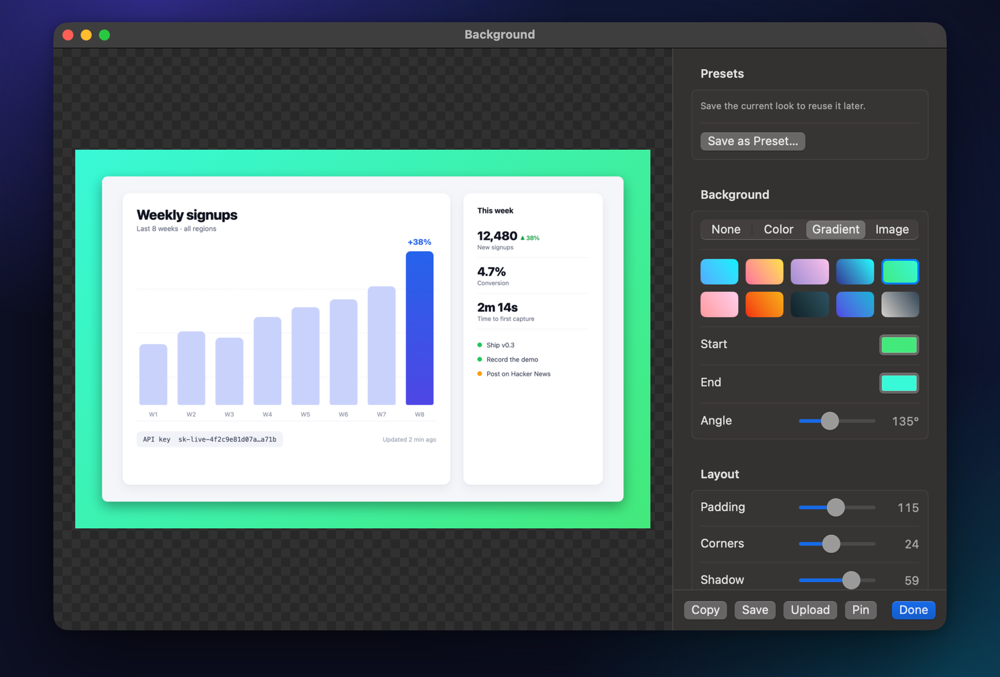
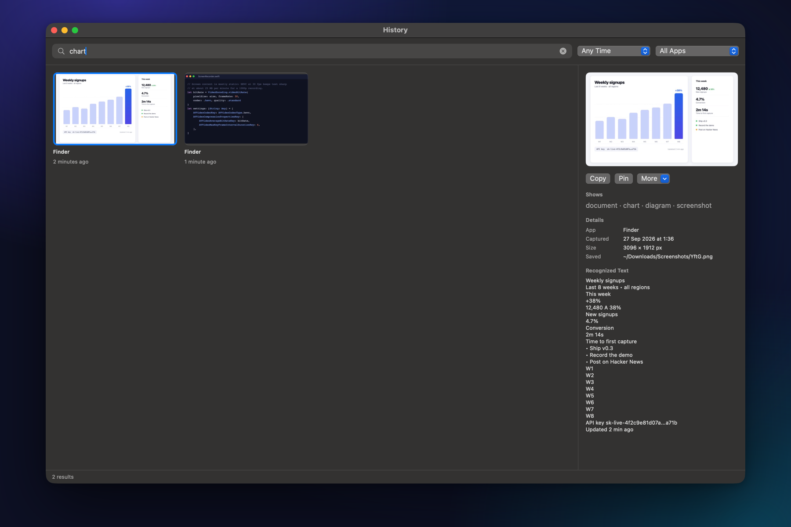
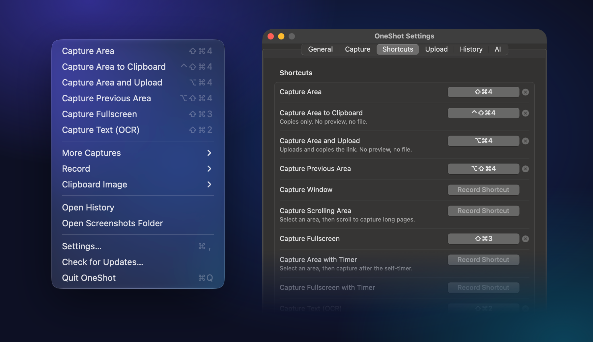
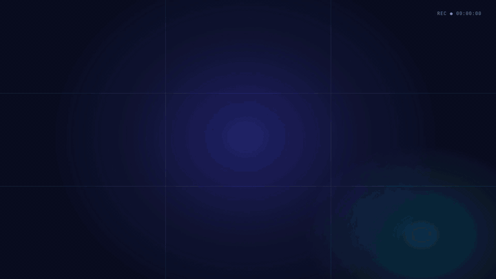

<p align="center">
  
</p>

<h1 align="center">OneShot</h1>

<p align="center">
  <strong>The free, open-source screenshot and screen recording app for macOS.</strong><br>
  Capture, annotate, record, upload and search, all from the menu bar and all on your Mac.
</p>

<p align="center">
  <a href="https://github.com/fatihacet/oneshot/releases/latest"></a>
  
  <a href="LICENSE"></a>
</p>

<p align="center">
  
</p>

<table>
  <tr>
    <td width="33%" valign="top">
      <h3>⚡️ Native and fast</h3>
      Written in Swift on ScreenCaptureKit and Vision. Press <kbd>⇧⌘4</kbd> and the screen freezes instantly, with a magnifier and live size label.
    </td>
    <td width="33%" valign="top">
      <h3>🔒 Private by default</h3>
      Text recognition, image labels and search run on your Mac. Nothing leaves it unless you upload a capture to <em>your own</em> storage.
    </td>
    <td width="33%" valign="top">
      <h3>💸 Free and open source</h3>
      MIT licensed. No account, no subscription, no telemetry. Updates itself with signed releases.
    </td>
  </tr>
</table>

## 🎬 Record your screen, Loom-style

Pick full screen, a window or an area, choose the resolution, your camera and microphone, and hit record. Your voice and the system audio are mixed into one track, and your camera sits in a round bubble that is recorded with the screen. Recordings are HEVC at 30 fps, so a 23-minute 1080p recording is about 570 MB instead of several gigabytes, with text that stays sharp.

<p align="center"></p>

- Full screen (any display), window or area, from 720p to 4K or original size, with a file size estimate before you start
- Microphone with a live level meter, system audio, and a draggable camera bubble in three sizes
- HEVC or H.264 at 30 or 60 fps; animated GIF recording too
- Stop from the menu bar; the recording lands in Quick Access, ready to drag, copy or upload

## ✏️ Annotate in seconds

Arrows, lines, rectangles, ellipses, pen, highlighter, text, numbered steps, pixelate and crop, each one key away (<kbd>A</kbd>, <kbd>N</kbd>, <kbd>X</kbd>…), with undo and redo. Pixelate API keys and emails before you share.

<p align="center"></p>

## 🎨 Make it presentable

Put any screenshot on a gradient, color or picture background with padding, rounded corners and a soft shadow. Pick an aspect ratio for social posts and save your favorite look as a preset.

<p align="center"></p>

## 🔎 Find any screenshot you ever took

Every capture is kept in a local history and indexed on your Mac: the text inside it, what the image shows (search "chart", "sunset" or "cat" to find pictures without any text), the app and the window. Search matches words and meaning, with date and app filters.

<p align="center"></p>

## ⌨️ Everything is a keystroke away

The menu bar menu shows the actions you gave a shortcut first; everything else is one submenu away. Every shortcut can be changed, and OneShot can take over the macOS screenshot shortcuts for you.

<p align="center"></p>

## ✨ And much more

<table>
  <tr>
    <td width="50%" valign="top"><strong>📌 Pin to screen</strong><br>Keep screenshots floating above everything, or capture straight to a pin with <kbd>⇧⌘2</kbd>. Scroll to resize, <kbd>⌥</kbd> + scroll for opacity, click-through lock.</td>
    <td width="50%" valign="top"><strong>📜 Scrolling capture</strong><br>Scroll by hand or let OneShot auto-scroll; frames are stitched live, with sticky headers kept once.</td>
  </tr>
  <tr>
    <td valign="top"><strong>☁️ Upload to your own storage</strong><br>AWS S3, Cloudflare R2, Backblaze B2 or MinIO. Public, custom domain or presigned links, copied to the clipboard. <kbd>⌥⌘4</kbd> captures and uploads in one go.</td>
    <td valign="top"><strong>🔤 Copy text from anything</strong><br><kbd>⌃⇧⌘2</kbd> recognizes text in any area of the screen, and reads QR codes and barcodes, on-device.</td>
  </tr>
  <tr>
    <td valign="top"><strong>⚡️ Quick Access</strong><br>A thumbnail after every capture with Copy, Save, Pin, Upload, Annotate and drag and drop into any app.</td>
    <td valign="top"><strong>🤖 Automation</strong><br>Every action has a <code>oneshot://</code> link and a <code>oneshot</code> command for Raycast, Alfred, Shortcuts and scripts.</td>
  </tr>
  <tr>
    <td valign="top"><strong>🪟 Window capture</strong><br>Press <kbd>Space</kbd> while selecting to capture a window, with or without its shadow.</td>
    <td valign="top"><strong>⏱ Self-timer and more</strong><br>Timed captures, previous area, copy-only captures, hidden desktop icons and widgets, and file name patterns.</td>
  </tr>
</table>

## 👀 See it in action

<p align="center"></p>

## Install

1. Download `OneShot-<version>.zip` from the [latest release](https://github.com/fatihacet/oneshot/releases/latest), unzip it and move OneShot to Applications.
2. Open it. Releases are not notarized yet, so macOS blocks the first launch: open **System Settings › Privacy & Security** and click **Open Anyway**.
3. The setup assistant walks you through the Screen Recording permission, your default actions and shortcuts.

OneShot keeps itself up to date. It needs macOS 14 Sonoma or later.

## Default shortcuts

All shortcuts can be changed or cleared in **Settings › Shortcuts**.

| Action | Shortcut |
| --- | --- |
| Capture Area (Space toggles window mode) | <kbd>⇧⌘4</kbd> |
| Capture Area to Clipboard (copy only, no preview, no file) | <kbd>⌃⇧⌘4</kbd> |
| Capture Area and Upload (copies the link, no preview, no file) | <kbd>⌥⌘4</kbd> |
| Capture Area and Pin (pins above other windows, no preview, no file) | <kbd>⇧⌘2</kbd> |
| Capture Previous Area | <kbd>⌥⇧⌘4</kbd> |
| Capture Fullscreen | <kbd>⇧⌘3</kbd> |
| Capture Text (OCR) | <kbd>⌃⇧⌘2</kbd> |
| Capture Window, Scrolling Area, timed captures, Record Screen, Record GIF, Open History | not set |

macOS reserves <kbd>⇧⌘3</kbd> and <kbd>⇧⌘4</kbd> for its own screenshot tool. OneShot offers to disable those on first launch; you can toggle them any time in **Settings › Shortcuts**. Other apps using the same shortcuts (for example CleanShot X or Dropshare) must release them too.

## Automation

Every action has a `oneshot://` link, so OneShot works with Raycast, Alfred, Shortcuts or any launcher:

```sh
open -g "oneshot://capture-area"
open -g "oneshot://capture-fullscreen?timer=5"
open -g "oneshot://record-gif"          # run again (or oneshot://stop-recording) to stop
```

Install the `oneshot` command from **Settings › General › Automation** to use the same commands from a terminal:

```sh
oneshot capture-area-to-clipboard
oneshot capture-text
oneshot pin-clipboard
oneshot --help
```

Commands: `capture-area`, `capture-area-to-clipboard`, `capture-area-and-upload`, `capture-previous-area`, `capture-window`, `capture-scrolling`, `capture-fullscreen`, `capture-area-with-timer`, `capture-fullscreen-with-timer`, `capture-text`, `record-video`, `record-gif`, `stop-recording`, `pin-clipboard`, `upload-clipboard`, `annotate-clipboard`, `background-clipboard`, `open-history`, `open-settings`, `setup`.

## Permissions

- **Screen & System Audio Recording**: required for every capture. Grant it in System Settings › Privacy & Security, then relaunch OneShot.
- **Microphone** and **Camera** (optional): asked for the first time you pick them in the recording panel.
- **Accessibility** (optional): only needed for auto-scroll in scrolling capture.

## Building from source

Requires macOS 14 or later and Xcode 26 or later (Swift 6 toolchain; compiles the Icon Composer app icon).

```sh
make cert      # once: creates a local self-signed signing identity (recommended)
make install   # builds build/OneShot.app, copies it to /Applications and launches it
```

Other targets: `make build` (debug build), `make test` (unit tests), `make app` (bundle only), `make run`, `make clean`.

The app icon is an Icon Composer document, `Resources/AppIcon.icon`. Its artwork is drawn in code; regenerate it and the README preview with `swift scripts/generate-icon.swift`. Background, glass and shadow settings live in its `icon.json` and can be tuned in Icon Composer.

<details>
<summary><strong>Why the local signing certificate?</strong></summary>

macOS ties the Screen Recording permission to the app's code signature. Ad-hoc signed builds get a new signature on every build, so macOS would ask for permission again after each rebuild. `make cert` creates a self-signed identity named `OneShot Local Signing` in your login keychain; `scripts/build-app.sh` uses it automatically. If the `OneShot Release Signing` identity that releases are signed with is in the keychain, it is preferred, so local builds and installed releases share one set of permissions. To use your own identity set `ONESHOT_SIGN_IDENTITY`.

Switching a build to a different identity leaves System Settings showing OneShot as allowed while macOS refuses the new signature. Reset the stale entries with `tccutil reset All dev.oneshot.OneShot`, relaunch, and grant the permissions again.

To remove the certificate later: open Keychain Access, search for "OneShot Local Signing", and delete the certificate and its private key.
</details>

<details>
<summary><strong>Releases and updates</strong></summary>

OneShot updates itself with [Sparkle](https://sparkle-project.org). The feed URL (`SUFeedURL`) and public key (`SUPublicEDKey`) live in `Resources/Info.plist`.

To publish a release, push a version tag once CI is green on `main`. The message of an annotated tag becomes the release notes on GitHub and in the update dialog:

```sh
git tag -a v0.4.0 -m "What changed"
git push origin v0.4.0
```

The Release workflow runs the tests, builds the app with the tag's version (the build number is the commit count), signs it, writes an EdDSA-signed `appcast.xml`, and publishes both with the zip as a GitHub release. It needs three repository secrets:

| Secret | Contents |
| --- | --- |
| `SPARKLE_PRIVATE_KEY` | Sparkle's private EdDSA key, exported with `generate_keys -x <file>` |
| `MACOS_SIGNING_CERTIFICATE` | Base64 of a `.p12` with the `OneShot Release Signing` identity |
| `MACOS_SIGNING_CERTIFICATE_PASSWORD` | The `.p12` password |

The release identity is self-signed, like the local one. Keeping it the same across releases keeps the Screen Recording permission after updates. `scripts/release.sh` produces the same files in `build/releases` locally without publishing them. Forks must generate their own Sparkle key with `.build/artifacts/sparkle/Sparkle/bin/generate_keys`, update both Info.plist values and set their own secrets.

The CI workflow runs the tests and builds the app on every push to `main` and on pull requests.
</details>

<details>
<summary><strong>Project layout</strong></summary>

```
Sources/OneShotCore/   Platform-independent logic with unit tests (Tests/OneShotCoreTests)
Sources/OneShot/
  App/         App entry point, menu bar
  Capture/     ScreenCaptureKit capture, selection overlay, capture flows
  Output/      Encoding, clipboard, saving, Quick Access overlay, toasts
  Annotation/  Annotation editor
  Background/  Background tool
  Pin/         Pinned screenshot windows
  Recording/   Screen recording, recording panel, camera bubble, microphone capture
  History/     Capture history, indexing and search
  OCR/         Vision text, barcode recognition and image labels
  Upload/      S3-compatible uploads and upload history
  AI/          Optional local models through Ollama
  HotKeys/     Global hotkeys, macOS screenshot shortcut toggling
  Onboarding/  Setup assistant
  Settings/    Preferences and settings window
  Support/     Permissions and helpers
```
</details>

## Roadmap

See [ROADMAP.md](ROADMAP.md) for what is done and what is coming next. Ideas and pull requests are welcome.

## License

[MIT](LICENSE)
